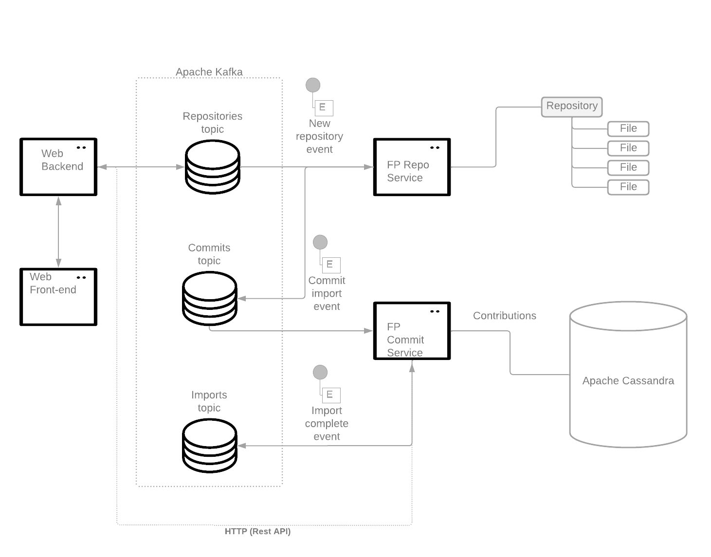

# FOSS Promoter

FOSS Promoter demo with Camel Core

# Idea

This demo simulates the backend for fictional online shop that is specialized in creating customized swags for contributors
and enthusiasts of Open Source software. One of the customization services offered by this company is a system that 
generates custom swags based on the contributions made by someone to a git repository.


# Design

The design is made to maximize learning, discussion and feature coverage. 



# How to play with this demo.

## Build

1. Build the code:
```shell
mvn clean package
```


2. Build the containers using docker compose:
```shell
docker-compose build 
```

3. Run everything using docker compose:
```shell
docker-compose up -d
```


## Setup Prometheus and Grafana

1. Add new data source in the Grafana data source configuration: http://localhost:3000/datasources/new.
2. In the URL field, enter the Prometheus URL: http://prometheus:9090


## Setup the Grafana Dashboard

1. Access the Dashboard import page at: http://localhost:3000/dashboard/import
2. Upload the the System Overview [dashboard JSON file](./grafana/System%20Overview.json). Select the Prometheus data source created previously.

# Run the demo

1. Send a Git repository for the system to generate the QR codes for each of the commits in the repository:

```shell
java -jar fp-cli/target/fp-cli-1.0.0-SNAPSHOT.jar  --api-server http://localhost:8080 --repository https://github.com/apache/maven.git
```

2. Repeat step 1 as much as you want.

3. Shutdown everything
```shell
docker-compose down
```

# Tips:

- To watch repositories that are being added to the system
```shell
docker exec -it foss-promoter-kafka-1 ./bin/kafka-console-consumer.sh --bootstrap-server localhost:9092 --topic repositories
```


- To watch the commit events emitted in the system
```shell
 docker exec -it foss-promoter-kafka-1 ./bin/kafka-console-consumer.sh --bootstrap-server localhost:9092 --topic commits
```

To test an invalid data input into the Web API service:

```shell
curl --verbose -X POST http://localhost:8080/api/repository/ -H 'Accept: application/json' -H 'Content-Type: application/json' -d '{"nameeee": "https://github.com/apache/camel.git"}'
```

# Try it on OpenShift

1. Before starting, you must install the Strimzi operator.
2. Create the Kafka cluster: `oc apply -f deploy/kafka-cluster.yaml`
3. Create the Kafka topics: `oc apply -f deploy/topics/topics.yaml`
4. Deploy the application: `oc apply -f deploy/demo.yaml` (see the note about Grafana).


# Talk Demos

- [JBCN 2022](https://github.com/orpiske/foss-promoter/tree/jbcn-2022)
- [Live - Cloud Conference Days](https://github.com/orpiske/foss-promoter/tree/live-cloud-conference-days-2022)
